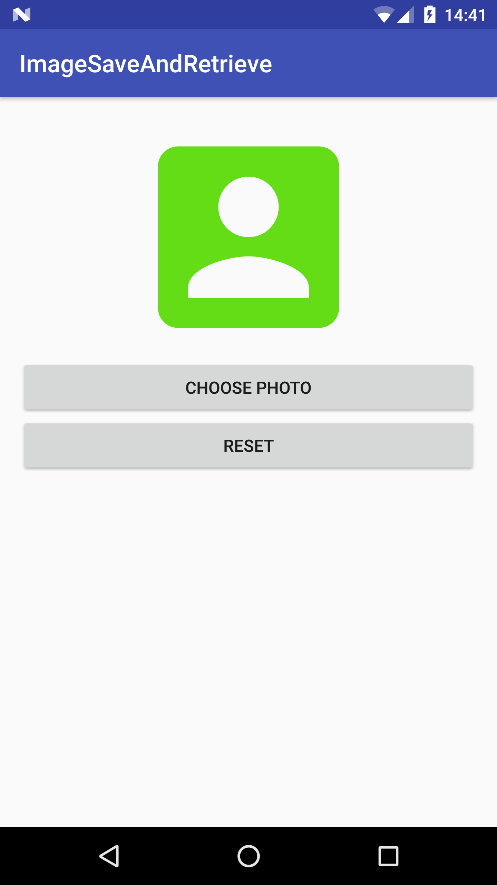
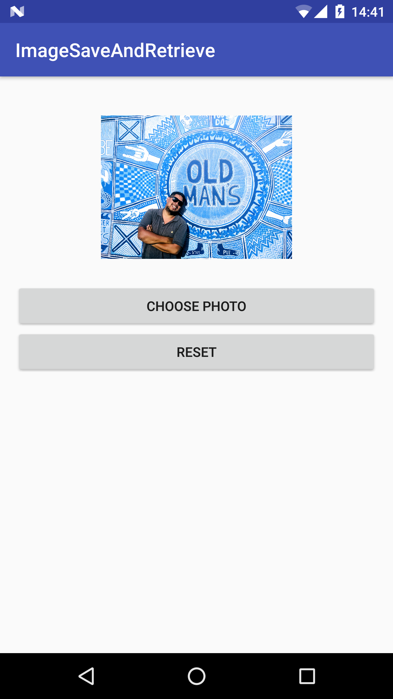

# Image Save and Retrieve App

Simple Android App showing how to save an Image URI and retrieve it using the Default Shared Preferences.

By Saving the image URI, the App will take up less memory and storage compared to saving the entire image bitmap by encoding it through a bitmapfactory (a common solution found in forums).
This is a much simpler and clean form. 

## Android Items

- Default SharedPreferences
- Permissions
- onActivityResult
- Image URI

## Description
- Select photo and display it in Activity
- Photo will persist when App is closed
- Remove photo and reset the Activity

## Screenshots
 

## Code
    private ImageView mImage;
    private Uri mImageUri;

     public void imageSelect() {
         permissionsCheck();
         Intent intent;
         if (Build.VERSION.SDK_INT < 19) {
             intent = new Intent(Intent.ACTION_GET_CONTENT);
         } else {
             intent = new Intent(Intent.ACTION_OPEN_DOCUMENT);
             intent.addCategory(Intent.CATEGORY_OPENABLE);
         }
         intent.setType("image/*");
         startActivityForResult(Intent.createChooser(intent, "Select Picture"), PICK_IMAGE_REQUEST);
     }
     public void permissionsCheck() {
         if (ContextCompat.checkSelfPermission(this,
                 Manifest.permission.READ_EXTERNAL_STORAGE)
                 != PackageManager.PERMISSION_GRANTED) {
             ActivityCompat.requestPermissions(this,
                     new String[]{Manifest.permission.READ_EXTERNAL_STORAGE}, 1);
             return;
         }
     }

     @Override
     protected void onActivityResult(int requestCode, int resultCode, Intent data) {
         // Check which request we're responding to
         if (requestCode == PICK_IMAGE_REQUEST) {
             // Make sure the request was successful
             if (resultCode == RESULT_OK) {
                 // The user picked a image.
                 // The Intent's data Uri identifies which item was selected.
                if (data != null) {
                    
                    // This is the key line item, URI specifies the name of the data
                    mImageUri = data.getData();
                    
                    // Saves image URI as string to Default Shared Preferences
                    SharedPreferences preferences = PreferenceManager.getDefaultSharedPreferences(this);
                    SharedPreferences.Editor editor = preferences.edit();
                    editor.putString("image", String.valueOf(mImageUri));
                    editor.commit();
                    
                    // Sets the ImageView with the Image URI
                    mImage.setImageURI(mImageUri);
                    mImage.invalidate();
                 }
             }
         }
     }
